# TEMI-MCBV3

TEMI-MCBV3 應用
AITEMI TEMI版本 Ardublockly ，下載:[ArdublocklyMCBV3_2024-01-17_00.05.7z](https://drive.google.com/file/d/1-iF4WjhvRBZfnkABZauuBBxRpyfF_2ol/view?usp=drive_link)

## 適用TEMI協會之MCBV3電路板硬體

### MCBV3 電路板硬體簡介

► R、G、B三色LED燈
► 4軸DC有刷馬達驅動(DC 5V)
► 伺服馬達控制介面(共用接腳) (DC 5V 或 18650 電源輸入電壓)
► I2C BUS
► SPI BUS、PS2搖桿介面
► HC SR-04 超音波
► 循跡用紅外線 反射式光遮斷器介面，5個類比輸入

#### 電路板電路圖

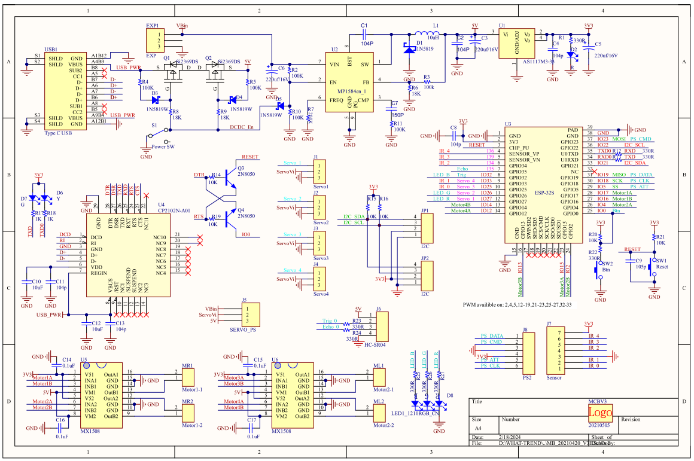

#### MCU區塊

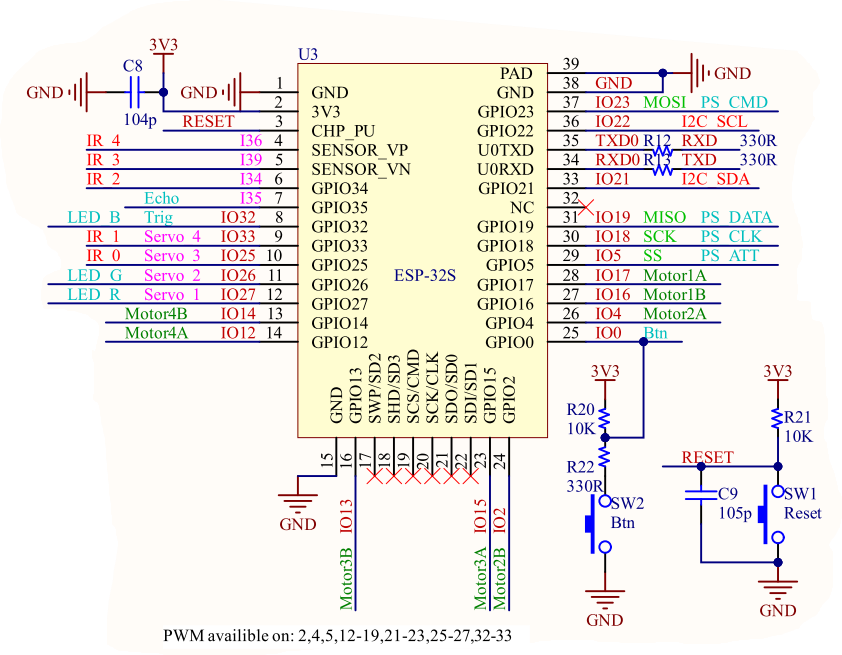

► 使用ESP32 4M模組
► 可供BT BLE應用
► 可供WIFI 2.4G應用
► 提供數位GPIO
► 提供類比輸入
► 提供 I2C BUS介面
► 提供Timer，可做PWM
► 提供SPI BUS介面
► 內建Bootloader，提供Arduino 更新FW
► 燒錄Bootloader，可恢復出廠預設的程式

ADC類比電壓輸入，當WiFI啟動後, 只剩下GPIO 36、39、34、35、 32、33等6隻腳可以用

### 電路板外觀

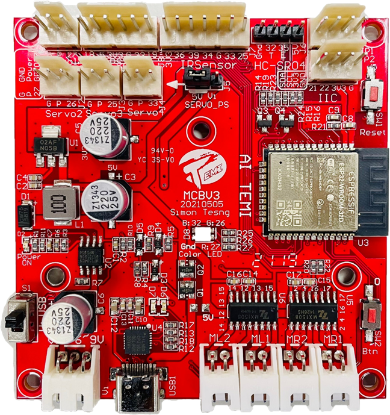

## 工作軟體環境需求

### 電腦及軟體作業系統

✧ MS WIN10/11 以上版本
✧ 下載後，使用7Z軟體，解壓縮檔案，解壓縮後的路徑，不可以有中文字

適用於MCBV3電路板的 下載 [Ardublockly](https://drive.google.com/file/d/1-iF4WjhvRBZfnkABZauuBBxRpyfF_2ol/view?usp=drive_link)

Ardublockly 需搭配對應的Arduino IDE，才能將積木程式轉換成Arduino 程式後，編譯下載到MCBV3電路板
適用於MCBV3電路板的下載 [Arduino IDE](https://drive.google.com/file/d/13tvwNZd0RjvDPp21khZYmijjzD2jenMy/view?usp=drive_link)
修改自GOOGLE Ardublockly，新增許多積木，以符合在MCBV3 電路板的應用所需，增加的部分，包含感測器、RTOS函數、串列介面應用、PS2無線搖桿、內建藍芽韌體，WIFI連線功能，外接LORA通訊模組，OLED顯示等。

[相關的範例及說明檔案下載](https://drive.google.com/drive/folders/1MVgIdXZrBUdcxw1Mz3yToCMELYsH55IT?usp=drive_link)

TEMI協會將Ardublockly搭配 Arduino應用所需要的程式庫已經安裝整合，避免程式開發過程中，缺少程式庫或電路板設定錯誤，無法順利執行。

下載並解壓縮Ardublockly及Arduino IDE。解壓縮後可以修改目錄名稱，但路徑不要有中文字，不要將程式解壓縮於桌面。

建議
路徑為: C:\ ardublockly 及 C:\arduino-1.8.19

# 啟動及設定Ardublockly

下載並解壓縮Ardublockly，可修改目錄名稱，但路徑不要有中文字，不要將程式解壓縮於桌面。

利用檔案總管，點擊開啟Ardublockly 目錄

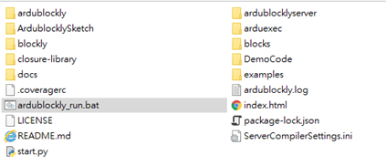

點選啟動 ardublockly_run.bat:

Image

正常啟動軟體出現畫面：

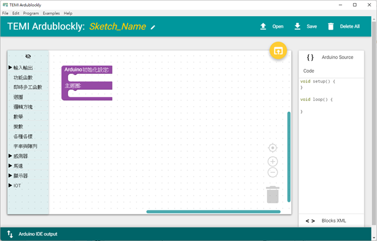

#### 偏好設定(EDIT--> Preference --> Setting)

　必須設定選用正確的Ａrduino IDE(arduino.exe)當作Compiler及正確的電路板TEMI MCBV3，如果選擇錯誤表示使用錯誤的版本，那產生的Arduino程式碼將無法正確編譯下載至MCBV3電路板中運行。

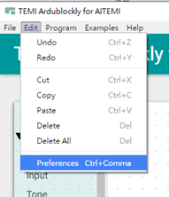
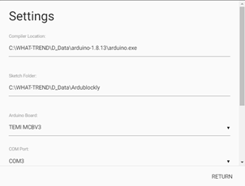

#### Ardublockly軟體版面介紹

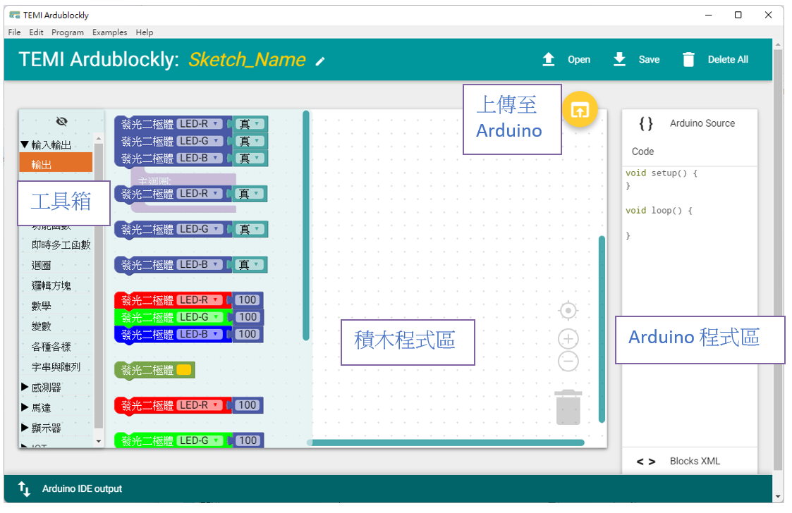

### 工具箱: 提供創作程式所需要的積木

積木程式區: 創作積木程式的工作平台
滑鼠於積木程式區:
左鍵在積木上按下，可拖曳積木;左鍵在沒有積木的位置按下，可拖曳積木程式區平台。
左鍵在積木上按下，可拖曳積木;左鍵在沒有積木的位置按下，可拖曳積木程式區平台。
右鍵在積木上按下，在所選的積木出現黃色框下拉視窗工作表，可選用對應動作。

複製: 複製所選的積木
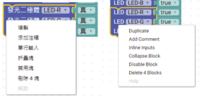

添加注釋: 非程式的說明文字，用來註解程式的功能

單行輸出/外部輸出

摺疊塊/展開塊

禁用塊/啟用塊

會移除積木的Arduino程式碼，但不移除積木，用於偵錯。

刪除 ? 塊，也可利用DEL鍵刪除塊

### 上傳至Arduino IDE

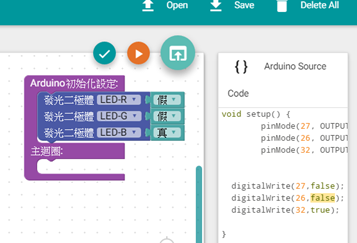

請點選此符號，啟動開啟Arduino IDE程式，並將原始碼同時上傳到Arduino IDE

當滑鼠移動至符號上方，變成藍色，點擊啟動。

如果點選Image沒有啟動Ａrduino IDE時，表示偏好設定(EDIT--> Preference --> Setting)中的Compiler Locations設定錯誤或未設定選擇正確的arduino.exe
目前TEMI協會版本的Arduino IDE,底色為黑色，如果開啟的Arduino IDE底色為白色時，表示載入的版本有誤。
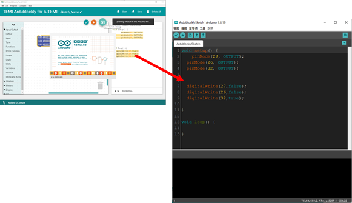

## 設定Arduino IDE及編譯上傳程式碼至MCBV3

### 設定Arduino IDE及編譯上傳程式碼至MCBV3

設定Arduino IDE環境
點選功能表 工具

開發板 : “MCBV3”
Upload Speed:”9216000”
Flash Frequency: “80MHz”
Flash Size:”4MB(32Mb)”
序列埠: “COM3” <-- 當電腦USB埠插接MCBV3電路板時，需要安裝USB COM埠的驅動程式，當驅動正確時，會出現對應的埠號。
燒錄器: “esp32”
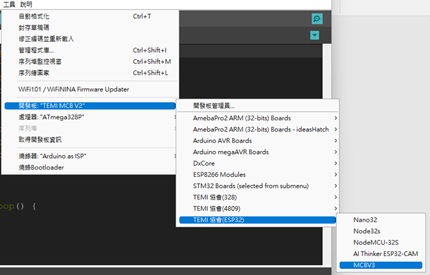
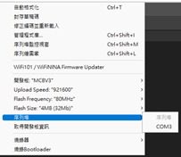

第五項中的序列埠，必須確認實驗板 USB埠與電腦的USB埠正確連接，並且對應到正確的序列埠編號。
確認方式，可將實驗板 USB線拔除重新點擊工具，觀察序列埠消失哪一個COM編號，重新接上實驗板 USB線，重新點擊工具，觀察序列埠增加哪一個COM編號，消失擊增加的COM編號為實驗板 USB連接到電腦正確的序列埠編號。如果經過一輪插拔
動作，序列埠並沒有增減，表示實驗板USB COM埠在您的電腦中，沒有正確驅動。

arduino-1.8.19\drivers\CP210x_6.7.4 目錄下提供實驗板USB COM埠的驅動程式，請自行參考WIN10 作業系統，硬體驅動的流程。

於桌面，滑鼠移到Image符號上方，點擊滑鼠右鍵🡪 出現系統功能表 點擊 裝置管理員，如果實驗板USB COM埠驅動正確，於連接埠可看到 Silicon Labs CP210x…(COM ?) 裝置，同理插拔實驗板USB線時會出現，消失裝置。
如果插拔都沒有任何裝置變動，表示USB線可能是充電非提供傳輸用途。
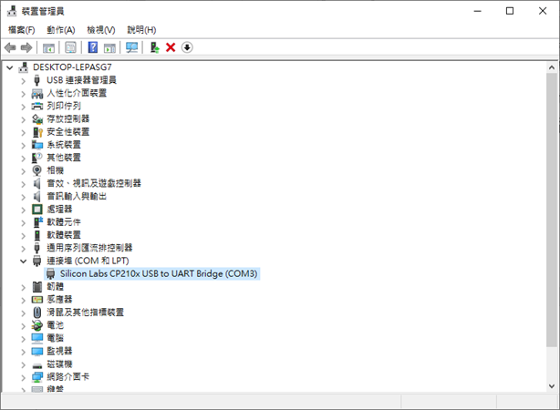

當設定都正確，則可編譯及上傳程式到實驗板上運行。
點擊Arduino IDE中的向右箭頭符號，”上傳”

此時Arduino IDE將進行程式編譯，如過程式碼正確，編譯完成後則啟動上傳燒錄到實驗板上。

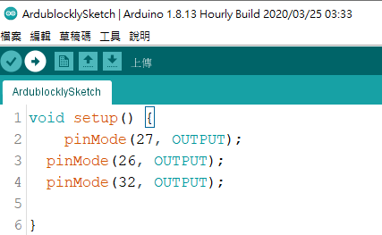

#### 檔案 🡪 偏好設定

由於程式碼可能錯誤，建議變更設定Arduino IDE的工作環境。

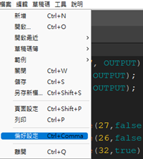

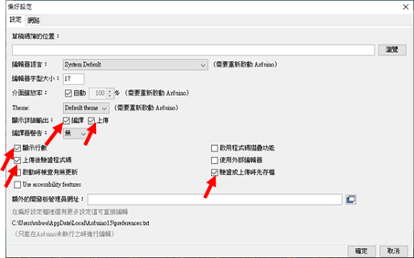

請於箭頭處點選打勾

編譯，編譯過程中，輸出編譯訊息或錯誤訊息，以利Debug

上傳，上傳燒錄過程中的訊息，上傳成功或失敗，避免沒有燒錄訊息，搞不清楚燒錄狀況。

顯示行數，顯示原始碼的行號。

上傳後驗證程式碼，上傳燒錄完成後，送出Reset訊號。

驗證或上傳時先存檔，Arduino IDE環境設定一次後，就會記憶於系統中，下次重新啟動時，會參考。

驗證上傳後，關閉Arduino IDE，因為Ardublockly於每次上傳動作時，會重新開Arduino IDE，並不會自動關閉之前開啟的程序。
