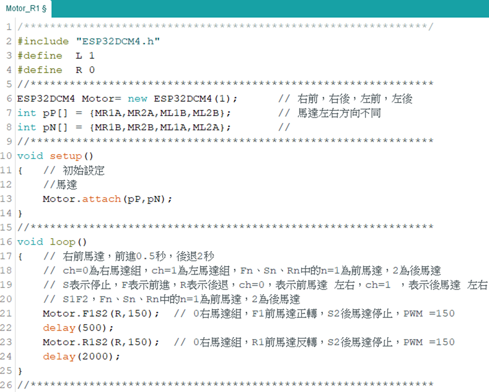
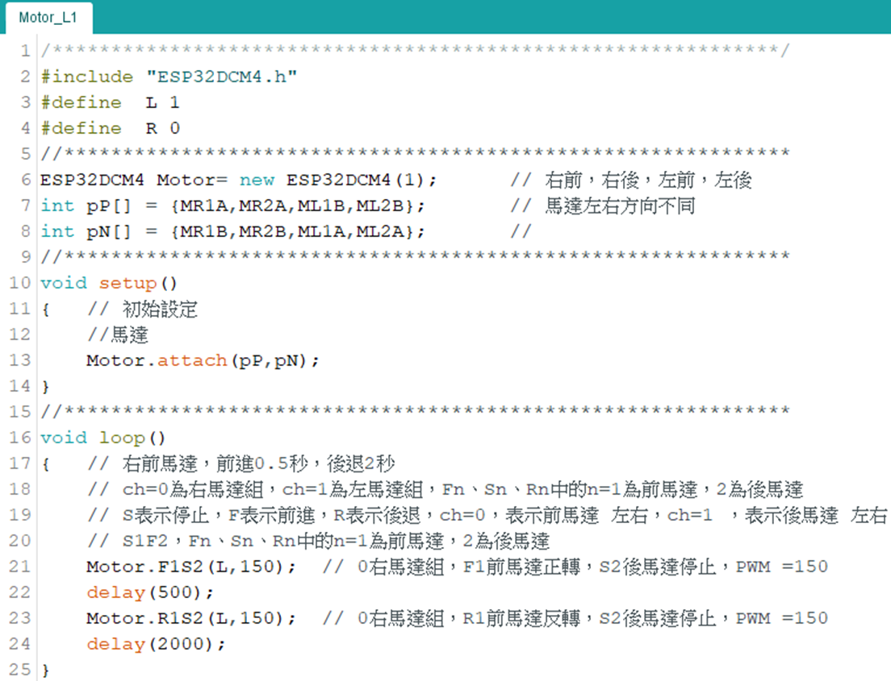
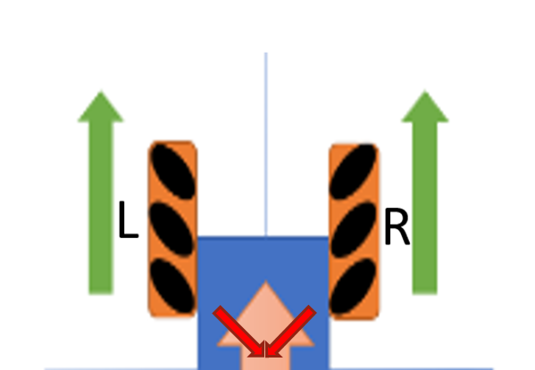
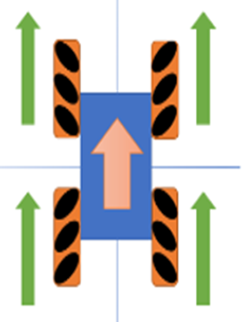
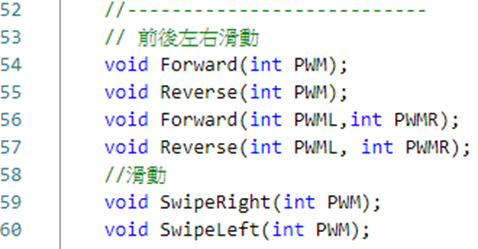
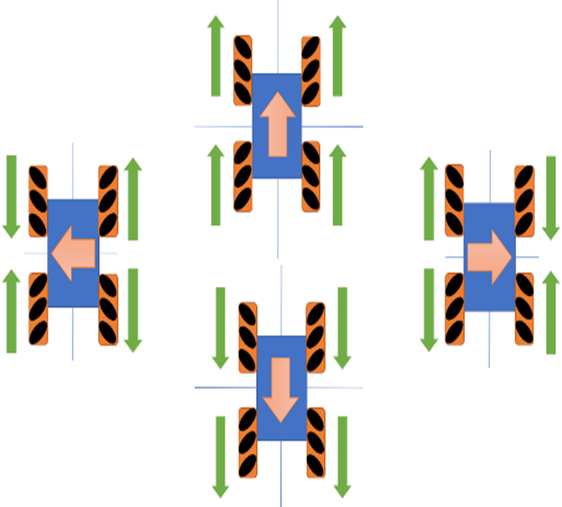
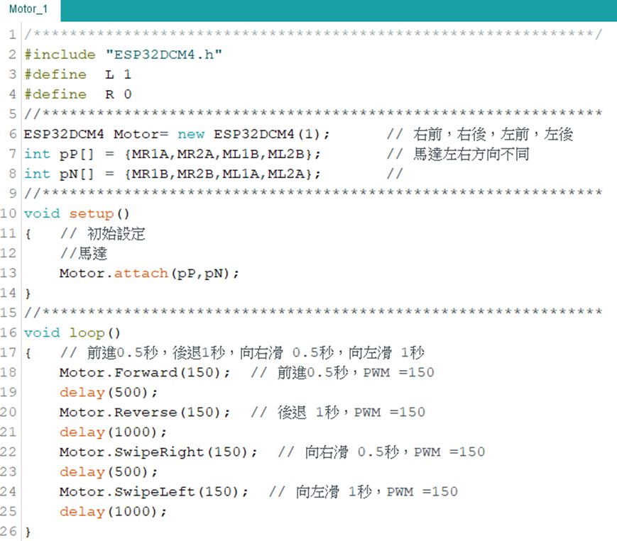

## 直流馬達控制右前輪

右前馬達，前進0.5秒，後退2秒

引用ESP32DCM4.h，程式庫，定義R為0，L為1

定義4顆馬達驅動的正極，負極腳位

因後馬達與前馬達安裝相反，故腳位對調

初始化，Motor物件，馬達驅動連接腳位，輸入兩個陣列

主迴圈：令右前馬達正轉(前進)0.5秒，後退2秒

## 直流馬達控制左前輪

左前馬達，前進0.5秒，後退2秒

引用ESP32DCM4.h，程式庫，定義R為0，L為1

定義4顆馬達驅動的正極，負極腳位

因後馬達與前馬達安裝相反，故腳位對調

初始化，Motor物件，馬達驅動連接腳位，輸入兩個陣列

主迴圈：令左前馬達正轉(前進)0.5秒，後退2秒

## AITEMI 小車麥克納姆輪4輪動作安裝

麥克納姆輪小車，輪子一套分成左右兩種形式，小車使用2套輪子，一共4顆。

假設坐在車上，面相前方，麥克納姆輪安裝方式，右側裝標註R的輪子，左側裝標註L 的輪子；反之，後面的輪子，則是以面向後方，右側裝標註R 的輪子，左側裝標註L 的輪子。

利用45º輔輪，利用向量方式，搭配4個主輪正反轉，轉換成小車不同方向的運動方向：一共18種運動方向

## AITEMI麥克納姆輪輪動作-前進、後退、左移、右移

車身姿態不變，控制小車前進，後退，左右移動
   

## AITEMI麥克納姆輪輪動作-前進、後退、左移、右移2

車身姿態不變， 前進0.5秒，後退1秒，向右滑 0.5秒，向左滑 1秒   

