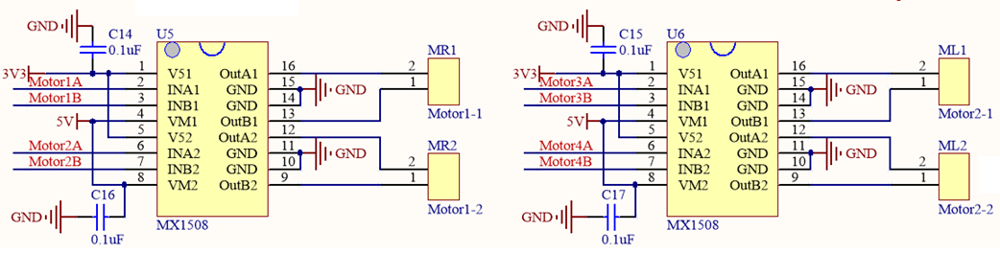
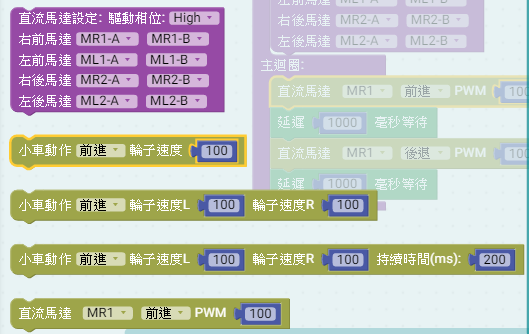

# 說明

 利用MCBV3電路板連接DC直流馬達，控制右前馬達正反轉，正轉1秒後，反轉1秒，週期運作。
# 電路圖

## MCBV3馬達驅動說明

1. 馬達5V供電, 耐壓9.5V, 最大2A, IO電壓3V3
2. PWM 控制，改變工作週期，可改變馬達耗電流的平均值，進而改變轉速
3. 可接4顆馬達，控制正反轉
4. 使用腳位編號: IO17、IO16，IO4、IO2，IO15、IO13，IO12、IO14共4組。
5. 有刷馬達，控制電刷供電相位，可控制馬達正反轉

## MCBV3電路板馬達驅動介面電路

## MCBV3電路板馬達驅動介面的位置

MCBV3一共有4個DC有刷馬達的驅動介面，使用2 pin 2.5mm Molex連接4顆TT直流馬達，做為4驅小車的動力驅動來源，連接埠名稱分別是ML1、MR1 小車前馬達左、右及ML2、MR2 小車後馬達左、右。

# Ardublockly 編輯積木程式

*** 注意先把AITEMI小車架高，避免練習馬達驅動，造成小車墜落損壞

## 練習一 控制 MR1(右前)馬達前進後退控制四顆馬達前進後退

### 1. 放置功能函數方塊

### 2. 選擇直流馬達設定方塊

### 3. 放入初始化設定

根據MCBV3電路，初始化腳位，驅動直流馬達IC，如此程式中對馬達下動作指令才能動作。

### 4. 選擇直流馬達動作方塊

馬達動作積木，分成2軸積木或4軸積木，選用時請注意。

此練習使用 ，下拉視窗選擇要動作的軸MR1(右前馬達)及動作方式(前進後退)，及動作時的PWM工作週期0 ~ 255(0% ~ 100%)數值；
積木以AITEMI 小車當作練習平台，積木以小車動作的方式，來設定馬達動作的功能。AITEMI小車使用4個麥克納姆輪，分別控制4個輪子前進、後退或停止，可產生18種小車的運動模式。在小車動作下拉視窗中，可以選擇；輪子的速度則是改變驅動輸出的PWM工作週期0 ~ 255(0% ~ 100%)。

### 5. 將方塊放進回圈內，並加入延遲方塊

控制馬達動作指令的時間，每一個指令需要動作時間才能達到目的。
<a href="MotorCtrl01.xml">下載積木程式檔 MotorCtrl01.xml</a>

# Arduino IDE上傳到MCBV3電路板

## 在Ardublockly編輯好程式後，點擊上傳到Arduino IDE

### Ardublockly原始程式

AITEMI 小車左前馬達連續正反轉1秒的 Arduino 原始程式碼:

<pre><code>
#include "ESP32DCM4.h"   // 使用ESP32 4軸DC馬達程式庫

ESP32DCM4 Motor = ESP32DCM4(1);  //建立馬達物件 Motor
int pP[] = { 17, 4, 13, 14};     //4軸馬達的連接腳位 正
int pN[] = { 16, 2, 15, 12 };    //4軸馬達的連接腳位 負
// 如果馬達動作相反，則在錯誤的軸 正負腳位對調

void setup() {             // Arduino 初始化設定
//Setup Motor
Motor.attach(pP,pN);   // Motor物件，連接對應的腳位

}

void loop() {   // Arduino 主迴圈
Motor.M[0].Forward(100);   //  Motor.M[0] 馬達正轉，PWM=100
delay(1000);               //  延遲1000毫秒(mS)
Motor.M[0].Reverse(100);   //  Motor.M[0] 馬達反轉，PWM=100
delay(1000);               //  延遲1000毫秒(mS)

}

# span

code
