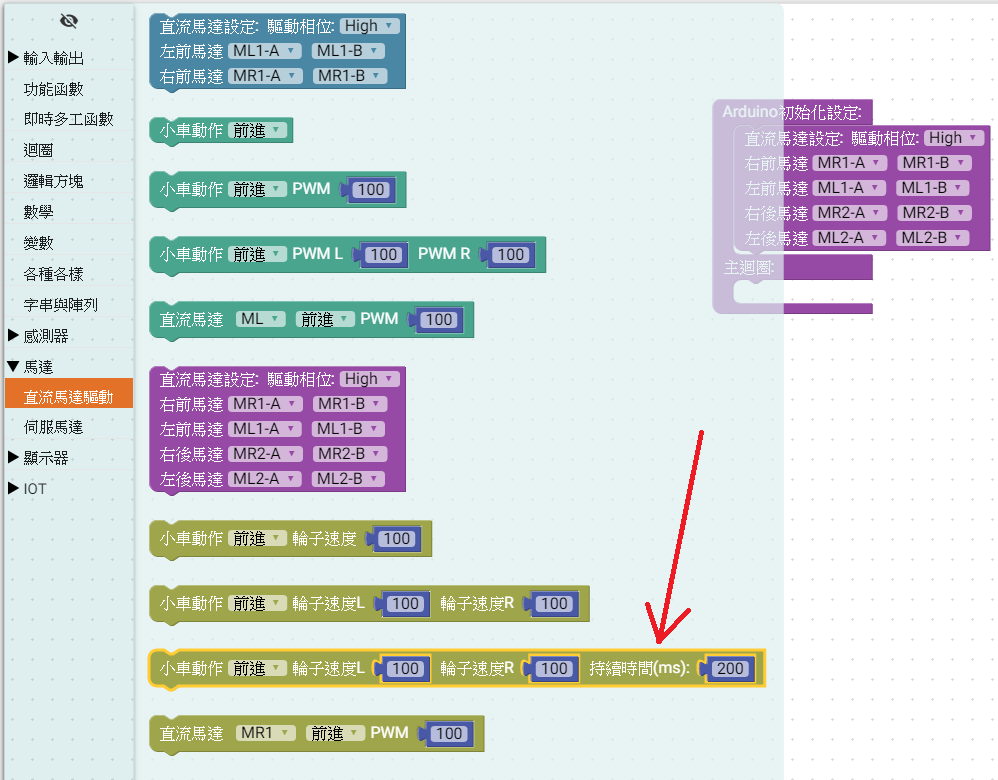
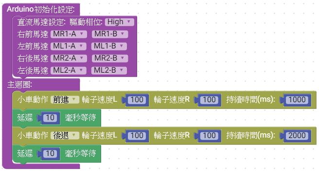
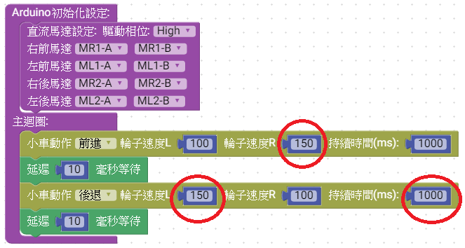

# 說明

 利用MCBV3電路板連接DC直流馬達，控制左、右馬達正反轉，反轉的PWM工作週期運作。
# 電路圖

## MCBV3馬達驅動說明

1. 馬達5V供電, 耐壓9.5V, 最大2A, IO電壓3V3
2. PWM 控制，改變工作週期，可改變馬達耗電流的平均值，進而改變轉速
3. 可接4顆馬達，控制正反轉
4. 使用腳位編號: IO17、IO16，IO4、IO2，IO15、IO13，IO12、IO14共4組。
5. 有刷馬達，控制電刷供電相位，可控制馬達正反轉

## MCBV3電路板馬達驅動介面電路

## MCBV3電路板馬達驅動介面的位置

MCBV3一共有4個DC有刷馬達的驅動介面，使用2 pin 2.5mm Molex連接4顆TT直流馬達，做為4驅小車的動力驅動來源，連接埠名稱分別是ML1、MR1 小車前馬達左、右及ML2、MR2 小車後馬達左、右。

# Ardublockly 編輯積木程式

*** 注意先把AITEMI小車架高，避免練習馬達驅動，造成小車墜落損壞

## 控制四顆馬達前進後退

### 1. 放置功能函數方塊

### 2. 選擇直流馬達設定方塊

### 3. 放入初始化設定

根據MCBV3電路，初始化腳位，驅動直流馬達IC，如此程式中對馬達下動作指令才能動作。

### 4. 選擇直流馬達動作方塊

馬達動作積木，分成2軸積木或4軸積木，選用時請注意。
此練習使用 改變動作時的PWM工作週期0 ~ 255(0% ~ 100%)數值，積木以AITEMI 小車當作練習平台，控制左右馬達的PWM數值及動作持續時間。

### 5. 將積木放進回圈內

修改小車動作(前進、後退、停止)，設定左右輪的PWM數值及本積木動作的時間。
<a href="MotorCtrl02.xml">下載積木程式檔 MotorCtrl02.xml</a>

### 6. Arduino IDE上傳到MCBV3電路板

在Ardublockly編輯好程式後，點擊上傳到Arduino IDE，編譯上傳燒錄到MCBV3電路板

**AITEMI 小車前進後退的 Arduino 原始程式碼:**
<pre><code>
#include "ESP32DCM4.h"   // 使用ESP32 4軸DC馬達程式庫

ESP32DCM4 Motor = ESP32DCM4(1);  //建立馬達物件 Motor
int pP[] = { 17, 4, 13, 14};     //4軸馬達的連接腳位 正
int pN[] = { 16, 2, 15, 12 };    //4軸馬達的連接腳位 負
// 如果馬達動作相反，則在錯誤的軸 正負腳位對調

void setup() {
//Setup Motor
Motor.attach(pP,pN);

}

void loop() {
Motor.Forward(100,100);    //以AITEMI小車為視角，控制小車前進
delay(1000);               //動作 1秒
Motor.Stop();              //結束動作，控制小車停車
delay(10);                 //結束動作 10mS  	Motor.Reverse(100,100);    //以AITEMI小車為視角，控制小車後退
delay(2000);               //動作 2秒
Motor.Stop();              //結束動作，控制小車停車
delay(10);                 //結束動作 10mS

}

</code>
</pre>

* 右前馬達持續正反轉
* 驅動馬達時，因電流大，需要外接電源，請勿直接使用電腦的USB供電，避免電流暴衝
* 使用AITEMI小車進行練習時，請將小車墊高，避免馬達動作時，小車發生暴走跌落

## 控制四顆馬達前進後退改變速度
 

修改設定左右輪的PWM數值100改成150，數值增加50為原數值100的50%，但因馬達推動輪子的力量不同，速度並非提升50%。

<a href="MotorCtrl02A.xml">下載積木程式檔 MotorCtrl02.xml</a>

## Arduino IDE上傳到MCBV3電路板

在Ardublockly編輯好程式後，點擊上傳到Arduino IDE，編譯上傳燒錄到MCBV3電路板

***AITEMI 小車前進後退的 Arduino 原始程式碼:***
<pre><code>
#include "ESP32DCM4.h"

ESP32DCM4 Motor = ESP32DCM4(1);
int pP[] = { 17, 4, 13, 14};
int pN[] = { 16, 2, 15, 12 };

void setup() {
      //Setup Motor
    Motor.attach(pP,pN);

}

void loop() {
  	Motor.Forward(100,150);  // <==150
  	delay(1000);
  	Motor.Stop();
  delay(10);
  	Motor.Reverse(150,100);  // <==150
  	delay(1000);
  	Motor.Stop();
  delay(10);

}

</code>
</pre>
