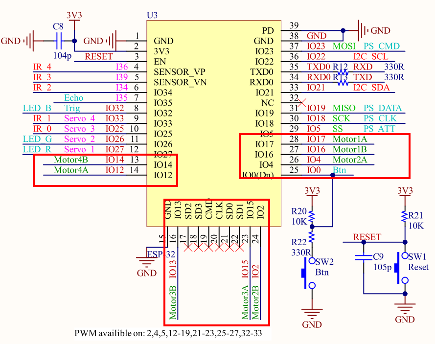
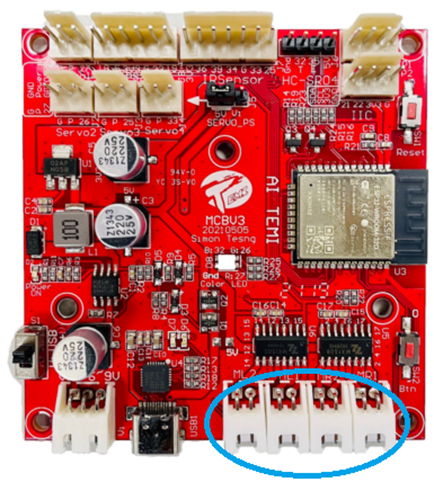
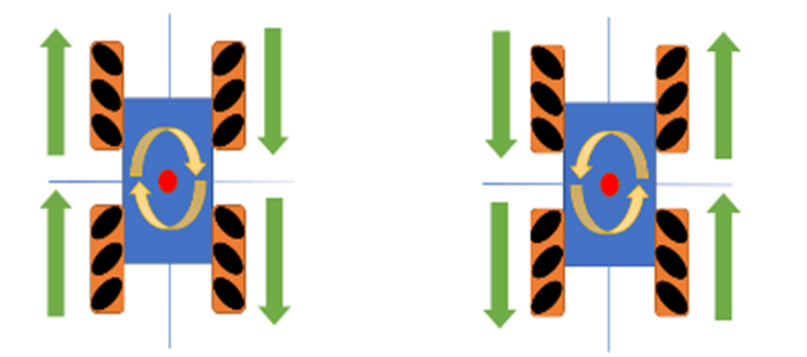
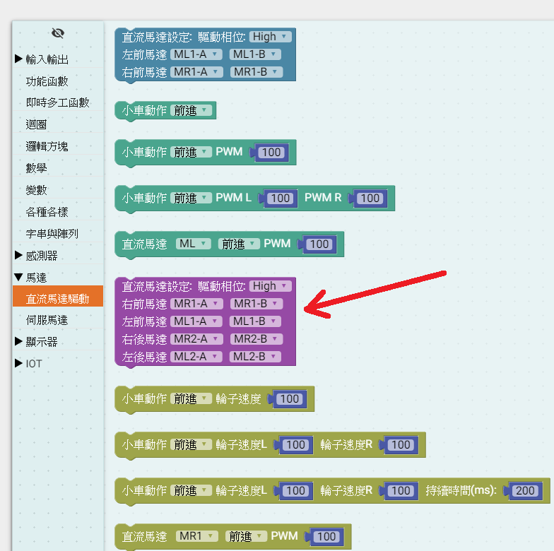

# 說明

 利用MCBV3電路板連接4軸DC直流馬達驅動的麥克納姆輪，練習控制18種組合的小車運動方式。
一共練習5組程式，分別是
* **1.AITMEI小車，前進、後退、左移、右移個1秒**
* **2.AITMEI小車，左斜前進1秒、右斜後退1秒、右斜前進1秒、左斜後退1秒**
* **3.AITMEI小車，前輪向左滑行0.3秒、前輪向右滑行0.6秒、前輪向左滑行0.3秒，後輪向左滑行0.3秒、後輪向右滑行0.6秒、後輪向左滑行0.3秒**
* **4.AITMEI小車，前進0.3秒、向右轉0.3秒、向左轉0.3秒、向左退0.3秒、向右退0.3秒、後退0.3秒**
* **5.AITMEI小車，原地逆時針旋轉(左旋)1秒，原地順時針旋轉(右旋)1秒**

# 電路圖

## MCBV3馬達驅動說明

1. 馬達5V供電, 耐壓9.5V, 最大2A, IO電壓3V3
2. PWM 控制，改變工作週期，可改變馬達耗電流的平均值，進而改變轉速
3. 可接4顆馬達，控制正反轉
4. 使用腳位編號: IO17、IO16，IO4、IO2，IO15、IO13，IO12、IO14共4組。
5. 有刷馬達，控制電刷供電相位，可控制馬達正反轉

## MCBV3電路板馬達驅動介面電路

## MCBV3電路板馬達驅動介面的位置

MCBV3一共有4個DC有刷馬達的驅動介面，使用2 pin 2.5mm Molex連接4顆TT直流馬達，做為4驅小車的動力驅動來源，連接埠名稱分別是ML1、MR1 小車前馬達左、右及ML2、MR2 小車後馬達左、右。
# AITEMI 麥克納姆輪小車

* **麥克納姆輪有L、R種形式，安裝時請注意方向，只有正確的安裝方向，小車的動作才能正常。**
* **4軸TT馬達也是必須正確插接於MCBV3電路板的ML1(左前輪)、MR1(右前輪)、ML2(左後輪)、MR2(右後輪)。**

## 麥克納姆輪動作原理-小車前進後退、向左向右移動

### 前進

   小車前進CarForword函數，令將小車上的4個直流馬達，驅使令其前進，當MR1及ML1兩輪同時前進時，MR1向前大約150度推進，ML1則前大約30度推進，由於這兩輪的推力相當，使這兩輪的轉子朝對方轉動達到這兩輪往兩力合成向量前進。此時後輪的動作類似RL輪推進互換，MR2輪往30度推進，ML2往150度推進，同樣的將小車往前推，達到小車前進的功能。

### 後退

小車後退CarReverse函數，令小車上的4個直流馬達，驅使令其後退，達到小車後退的功能。
### 向左橫移

小車ML2、MR1馬達前進及控制ML1、MR2後退，可使小車不變姿態，往左移。
### 向右橫移
小車MR2、ML1馬達前進及控制MR1、ML2後退，可使小車不變姿態，往右移。(馬達動作與向左移相反)

## 麥克納姆輪動作原理-右、左斜前進、右斜、左斜後退

驅動4軸直流馬達及控制小車斜角移動、斜角動作的積木程式函數一共有4個函數，分別是45、135、225、315度的滑行，此時4顆馬達，僅2顆動作，且動作方向相同。

## 麥克納姆輪動作原理-小車自旋轉

以車為中心自旋轉 (2)，車身改變方向，右旋(順時針) ，左旋(逆時針)

## 麥克納姆輪動作原理-向前後左右轉彎

以車後2角為中心點向前右、左轉 (2)，以車前2角為中心點向右、左後退轉 (2)後退

## 麥克納姆輪動作原理-前、後輪飄移

# Ardublockly 編輯積木程式

*** 注意先把AITEMI小車架高，避免練習馬達驅動，造成小車墜落損壞

## 控制四顆馬達前進後退

### 1. 放置功能函數方塊

### 2. 選擇直流馬達設定方塊

### 3. 放入初始化設定

根據MCBV3電路，初始化腳位，驅動直流馬達IC，如此程式中對馬達下動作指令才能動作。

### 練習1:組合 AITMEI小車，前進、後退、左移、右移個1秒積木程式

#### 前進
#### 後退
#### 向左橫移
#### 向右橫移

#### 練習1積木程式

修改小車動作(前進、後退、停止)，設定左右輪的PWM數值及本積木動作的時間。
<a href="MotorCtrl03_1.xml">下載積木程式檔 MotorCtrl03_1.xml</a>

### Arduino IDE上傳到MCBV3電路板

在Ardublockly編輯好程式後，點擊上傳到Arduino IDE，編譯上傳燒錄到MCBV3電路板

**AITMEI小車，前進、後退、左移、右移個1秒積木程式 Arduino 原始程式碼:**
<pre><code>
#include "ESP32DCM4.h"   // 使用ESP32 4軸DC馬達程式庫

ESP32DCM4 Motor = ESP32DCM4(1);  //建立馬達物件 Motor
int pP[] = { 17, 4, 13, 14};     //4軸馬達的連接腳位 正
int pN[] = { 16, 2, 15, 12 };    //4軸馬達的連接腳位 負
// 如果馬達動作相反，則在錯誤的軸 正負腳位對調
void setup() {
      //Setup Motor
    Motor.attach(pP,pN);

}

void loop() {
  	Motor.Forward(100);    //令AITEMI小車前進
  delay(1000);            // 動作1秒鐘
  	Motor.Reverse(100);    //令AITEMI小車後退進
  delay(1000);
  	Motor.SwipeLeft(100);    //令AITEMI小車左移
  delay(1000);
  	Motor.SwipeRight(100);    //令AITEMI小車右移
  delay(1000);

}

</code>
</pre>

* 驅動馬達時，因電流大，需要外接電源，請勿直接使用電腦的USB供電，避免電流暴衝
* 使用AITEMI小車進行練習時，請將小車墊高，避免馬達動作時，小車發生暴走跌落

### 練習2:組合 AITMEI小車，左斜前進1秒、右斜後退1秒、右斜前進1秒、左斜後退1秒積木程式

#### 

#### 練習2積木程式

AITEMI 小車動作路徑，類似V字形軌跡。
<a href="MotorCtrl03_2.xml">下載積木程式檔 MotorCtrl03_2.xml</a>

### Arduino IDE上傳到MCBV3電路板

在Ardublockly編輯好程式後，點擊上傳到Arduino IDE，編譯上傳燒錄到MCBV3電路板

**AITMEI小車，左斜前進1秒、右斜後退1秒、右斜前進1秒、左斜後退1秒積木程式Arduino 原始程式碼:**
<pre><code>
#include "ESP32DCM4.h"   // 使用ESP32 4軸DC馬達程式庫

ESP32DCM4 Motor = ESP32DCM4(1);  //建立馬達物件 Motor
int pP[] = { 17, 4, 13, 14};     //4軸馬達的連接腳位 正
int pN[] = { 16, 2, 15, 12 };    //4軸馬達的連接腳位 負
// 如果馬達動作相反，則在錯誤的軸 正負腳位對調

void setup() {
//Setup Motor
Motor.attach(pP,pN);

}

void loop() {
  	Motor.DiagonalLeftUp(100);    //**令AITEMI小車左前移**
  delay(1000);
  	Motor.DiagonalRightDown(100); //**令AITEMI小車左後移**
  delay(1000);
  	Motor.DiagonalRightUp(100);  //**令AITEMI小車右前移**
  delay(1000);
  	Motor.DiagonalLeftDown(100); //**令AITEMI小車右後移**
  delay(1000);

}

</code>
</pre>

### 練習3:組合 AITMEI小車，前輪向左滑行0.3秒、前輪向右滑行0.6秒、前輪向左滑行0.3秒，後輪向左滑行0.3秒、後輪向右滑行0.6秒、後輪向左滑行0.3秒積木程式

#### 練習3積木程式

 
<a href="MotorCtrl03_3.xml">下載積木程式檔 MotorCtrl03_3.xml</a>

### Arduino IDE上傳到MCBV3電路板

在Ardublockly編輯好程式後，點擊上傳到Arduino IDE，編譯上傳燒錄到MCBV3電路板

**AITMEI小車，前輪向左滑行0.3秒、前輪向右滑行0.6秒、前輪向左滑行0.3秒，後輪向左滑行0.3秒、後輪向右滑行0.6秒、後輪向左滑行0.3秒 Arduino 原始程式碼:**
<pre><code>
#include "ESP32DCM4.h"   // 使用ESP32 4軸DC馬達程式庫

ESP32DCM4 Motor = ESP32DCM4(1);  //建立馬達物件 Motor
int pP[] = { 17, 4, 13, 14};     //4軸馬達的連接腳位 正
int pN[] = { 16, 2, 15, 12 };    //4軸馬達的連接腳位 負
// 如果馬達動作相反，則在錯誤的軸 正負腳位對調

void setup() {
//Setup Motor
Motor.attach(pP,pN);

}

void loop() {
  	Motor.DriftLeftUp(100);  //前輪向左滑行
  delay(300);     // 0.3秒
  	Motor.DriftRightUp(100);  //前輪向右滑行
  delay(600);     // 0.6秒
  	Motor.DriftLeftUp(100); // 前輪向左滑行
  delay(300);     // 0.3秒
  	Motor.DriftLeftDown(100); //後輪向左滑行
  delay(300);     // 0.3秒
  	Motor.DriftRightDown(100); //後輪向右滑行
  delay(600);     // 0.6秒
  	Motor.DriftLeftDown(100);  //後輪向左滑行
  delay(300);     // 0.3秒

}

</code>
</pre>

### 練習4:組合 AITMEI小車，前進0.3秒、向右轉0.3秒、向左轉0.3秒、向左退0.3秒、向右退0.3秒、後退0.3秒積木程式

#### 前進
#### 後退

以車後2角為中心點向前右、左轉 (2)，以車前2角為中心點向右、左後退轉 (2)後退

#### 練習4積木程式

<a href="MotorCtrl03_4.xml">下載積木程式檔 MotorCtrl03_4.xml</a>

### Arduino IDE上傳到MCBV3電路板

在Ardublockly編輯好程式後，點擊上傳到Arduino IDE，編譯上傳燒錄到MCBV3電路板

**AITMEI小車，前進0.3秒、向右轉0.3秒、向左轉0.3秒、向左退0.3秒、向右退0.3秒、後退0.3秒積木程式 Arduino 原始程式碼:**
<pre><code>
#include "ESP32DCM4.h"   // 使用ESP32 4軸DC馬達程式庫

ESP32DCM4 Motor = ESP32DCM4(1);  //建立馬達物件 Motor
int pP[] = { 17, 4, 13, 14};     //4軸馬達的連接腳位 正
int pN[] = { 16, 2, 15, 12 };    //4軸馬達的連接腳位 負
// 如果馬達動作相反，則在錯誤的軸 正負腳位對調

void setup() {
//Setup Motor
Motor.attach(pP,pN);

}

void loop() {
  	Motor.Forward(100);  //前進
  delay(300);           // 0.3秒
  	Motor.TurnRight(100);//右轉
  delay(300);
  	Motor.TurnLeft(100);//左轉
  delay(300);
  	Motor.BackLeft(100);//右退
  delay(300);
  	Motor.BackRight(100);//左退
  delay(300);
  	Motor.Reverse(100);//後退
  delay(300);

}

</code>
</pre>

### 練習5:組合AITMEI小車，原地逆時針旋轉(左旋)1秒，原地順時針旋轉(右旋)01秒秒積木程式

以車為中心自旋轉 (2)，車身改變方向，右旋(順時針) ，左旋(逆時針)

#### 練習5積木程式

<a href="MotorCtrl03_5.xml">下載積木程式檔 MotorCtrl03_5.xml</a>

### Arduino IDE上傳到MCBV3電路板

在Ardublockly編輯好程式後，點擊上傳到Arduino IDE，編譯上傳燒錄到MCBV3電路板

**AITMEI小車，原地逆時針旋轉(左旋)1秒，原地順時針旋轉(右旋)1秒積木程式 Arduino 原始程式碼:**
<pre><code>
#include "ESP32DCM4.h"   // 使用ESP32 4軸DC馬達程式庫

ESP32DCM4 Motor = ESP32DCM4(1);  //建立馬達物件 Motor
int pP[] = { 17, 4, 13, 14};     //4軸馬達的連接腳位 正
int pN[] = { 16, 2, 15, 12 };    //4軸馬達的連接腳位 負
// 如果馬達動作相反，則在錯誤的軸 正負腳位對調

void setup() {
//Setup Motor
Motor.attach(pP,pN);

}

void loop() {
  	Motor.RotationLeft(100);  //左旋
  delay(1000);
  	Motor.RotationRight(100); //右旋
  delay(1000);

}

</code>
</pre>

