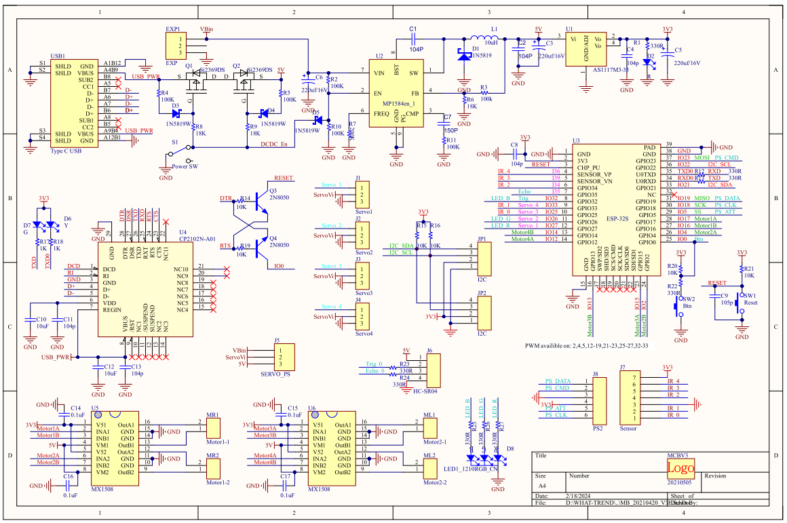
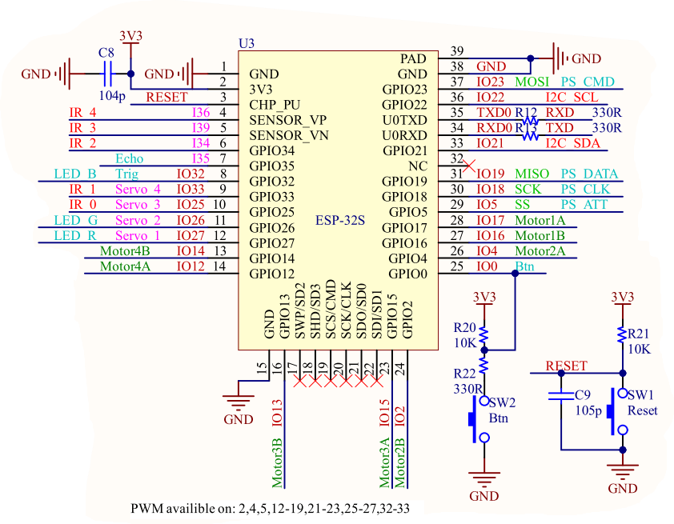
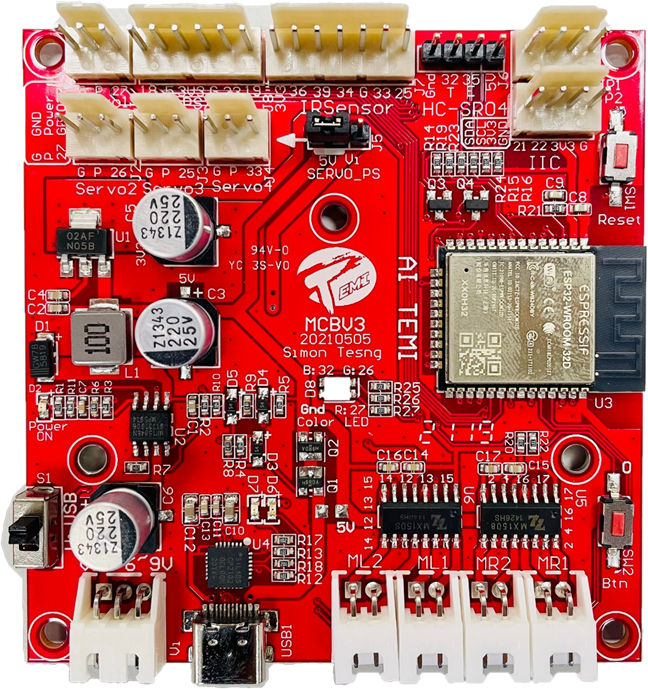
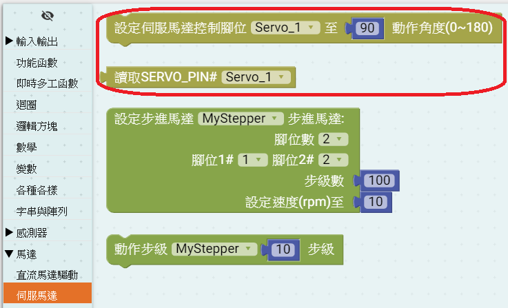
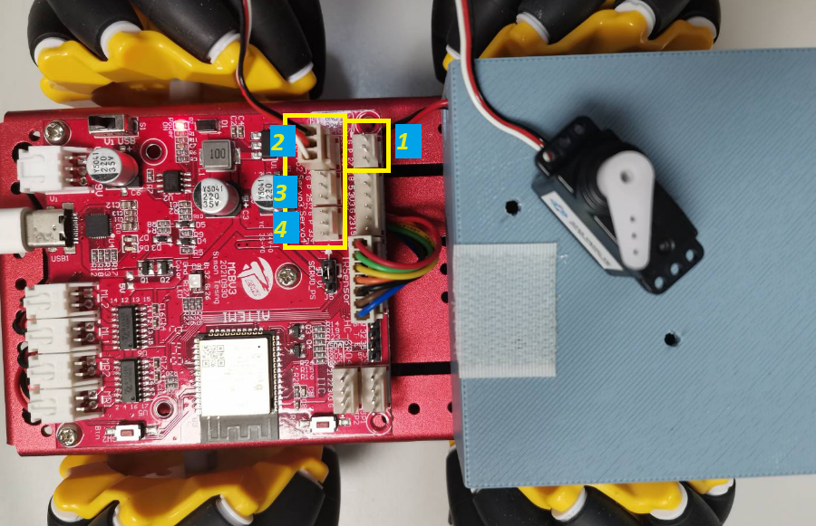
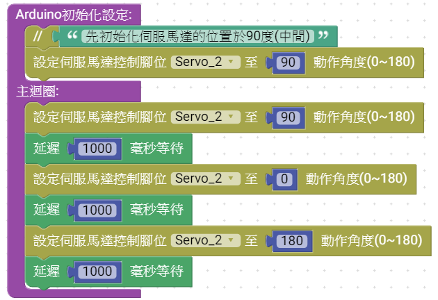
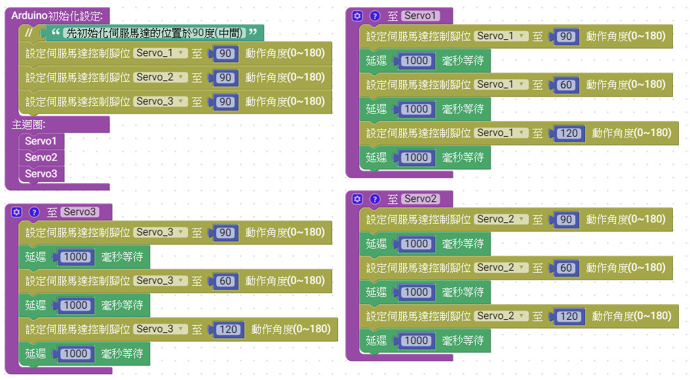
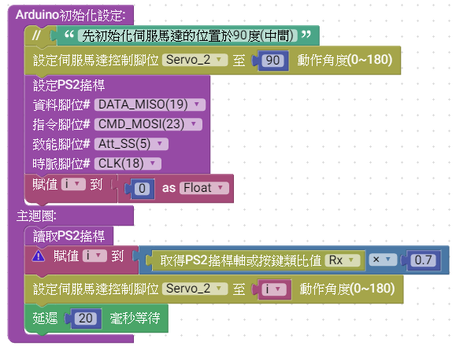

# 說明
     MCBV3 連接S50標準伺服馬達。
*  **練習1.控制命令90度位置，再轉向至0度，再轉向至180度**
*  **練習2.承上練習，改成Servo1、Servo2、Servo3函數，分別控制3個伺服馬達**
*  **練習3.利用PS2搖桿，按鍵控制伺服馬達轉向**

#### 適用TEMI協會之MCBV3電路板硬體

► R、G、B三色LED燈
► 4軸DC有刷馬達驅動(DC 5V)
► 伺服馬達控制介面(共用接腳) (DC 5V 或 18650 電源輸入電壓)
► I2C BUS
► SPI BUS、PS2搖桿介面
► HC SR-04 超音波
► 循跡用紅外線 反射式光遮斷器介面，5個類比輸入

#### 電路板電路圖

如上圖所示，MCBV3電路板，一共有4個伺服馬達的接頭
* Sevo1連接MCU的IO27,與三色LED燈的紅色LED共用，驅動時紅色LED燈會閃爍
* Sevo2連接MCU的IO26,與三色LED燈的綠色LED共用，驅動時綠色LED燈會閃爍
* Sevo3連接MCU的IO25，與循跡車紅外線感測器共用接腳
* Sevo4連接MCU的IO33，與循跡車紅外線感測器共用接腳
* 

### 電路板外觀

# Ardublockly 編輯積木程式
## 相關積木

  **工具列=>馬達=>伺服馬達**

## 練習1.控制命令90度位置，再轉向至0度，再轉向至180度
### 積木程式

如上圖，將S50伺服馬達與MCBV3電路板的Servr_2連接

組裝積木程式，於Arduino 初始化設定，將伺服馬達初始設定在90度位置
於主迴圈，組裝伺服馬達動作
* **請注意設定正確的Servo編號**,<a href="Servo_1.xml">下載積木程式檔 Servo_1.xml</a>

### Arduino IDE上傳到MCBV3電路板

在Ardublockly編輯好程式後，點擊上傳到Arduino IDE，編譯上傳燒錄到MCBV3電路板

**控制命令90度位置，再轉向至0度，再轉向至180度 Arduino 原始程式碼:**
<pre><code>
#include <ESP32Servo.h>  //載入 EPS32的伺服馬達程式庫

Servo myServo26;         //建立myServo26伺服馬達物件

void setup() {
  myServo26.setPeriodHertz(50);   //myServo26伺服馬達物件，PWM頻率
myServo26.attach(26);             //myServo26伺服馬達物件，連接IO26腳

  // "先初始化伺服馬達的位置於90度(中間)"
  myServo26.write(90);     //myServo26伺服馬達動作至90度位置

}

void loop() {
  myServo26.write(90);     // myServo26伺服馬達動作至90度位置
  delay(1000);             // 動作等待時間,1秒鐘
  myServo26.write(0);      // myServo26伺服馬達動作至0度位置
  delay(1000);             // 動作等待時間,1秒鐘
  myServo26.write(180);    // myServo26伺服馬達動作至180度位置
  delay(1000);             // 動作等待時間,1秒鐘

}
</code>
</pre>

* **由於0度與180度是伺服馬達動的極限值(不同型號有不同的極限)，故於0度或180度位置，馬達會抖動比較嚴重**
* **伺服馬達，上電後不可以外力使其轉動(會使齒輪崩壞)**

## 練習2.承上練習，改成Servo1、Servo2、Servo3函數，分別控制3個伺服馬達
### 積木程式

如上圖，將S50伺服馬達與MCBV3電路板的Servo_1、Servo_2、Servo_3連接
組裝Servo1,Servo2,Servo3函數
組裝積木程式，於Arduino 初始化設定，將伺服馬達初始設定在90度位置
於主迴圈，呼叫Servo1,Servo2,Servo3

* **請注意設定正確的Servo編號**,<a href="Servo_2.xml">下載積木程式檔 Servo_2.xml</a>

### Arduino IDE上傳到MCBV3電路板

在Ardublockly編輯好程式後，點擊上傳到Arduino IDE，編譯上傳燒錄到MCBV3電路板

**改成Servo1、Servo2、Servo3函數，分別控制3個伺服馬達 Arduino 原始程式碼:**
<pre><code>
#include <ESP32Servo.h>  //載入 EPS32的伺服馬達程式庫

Servo myServo27;  //建立myServo27伺服馬達物件
Servo myServo26;  //建立myServo26伺服馬達物件
Servo myServo25;  //建立myServo25伺服馬達物件

// 描述該功能...
void Servo1() {  // Servo1函數
  myServo27.write(90);
  delay(1000);
  myServo27.write(60);
  delay(1000);
  myServo27.write(120);
  delay(1000);
}

// 描述該功能...
void Servo3() {  // Servo3函數
  myServo25.write(90);
  delay(1000);
  myServo25.write(60);
  delay(1000);
  myServo25.write(120);
  delay(1000);
}

// 描述該功能...
void Servo2() {  // Servo2函數
  myServo26.write(90);
  delay(1000);
  myServo26.write(60);
  delay(1000);
  myServo26.write(120);
  delay(1000);
}

void setup() {
     // 設定myServo27、myServo26、myServo25物件
  myServo27.setPeriodHertz(50);
myServo27.attach(27);
  myServo26.setPeriodHertz(50);
myServo26.attach(26);
  myServo25.setPeriodHertz(50);
myServo25.attach(25);

  // "先初始化伺服馬達的位置於90度(中間)"
  myServo27.write(90);
  myServo26.write(90);
  myServo25.write(90);

}

void loop() {
  Servo1();  // 呼叫函數
  Servo2();
  Servo3();

}
</code>
</pre>

* **60度與120度位置，馬達會抖動比較不明顯**
* **呼叫Servo1()-->Servo2()-->Servo3()每個函數都有延遲3秒，故馬達動作一個循環為9秒**

## 練習3.利用PS2的右搖桿X軸 ，控制Servo_1伺服馬達
### 積木程式

如上圖，將S50伺服馬達與MCBV3電路板的Servo_1連接,並連接好PS2無線無線搖桿
組裝積木程式，於Arduino 初始化設定，將伺服馬達初始設定在90度位置，並初始化PS2搖桿
新增一個folat型別的i變數，用來轉換PS2 RX軸的數據 0~255轉換成 0~180
於主迴圈，呼叫讀取PS2搖桿，換算PS2 RX軸的數據 0~255轉換成 0~180(大約是0.7倍)
將i傳給伺服馬達物件
延遲20mS給馬達及PS2搖桿動作

* **請注意設定正確的Servo編號**,<a href="Servo_3.xml">下載積木程式檔 Servo_3.xml</a>

### Arduino IDE上傳到MCBV3電路板

在Ardublockly編輯好程式後，點擊上傳到Arduino IDE，編譯上傳燒錄到MCBV3電路板

**利用PS2的右搖桿X軸 ，控制Servo_1伺服馬達 Arduino 原始程式碼:**
<pre><code>
#include <ESP32Servo.h>      //載入 EPS32的伺服馬達程式庫
#include  <PS2X_lib_temi.h>  //載入 PS2搖桿程式庫

float i;   //建立一個 i變數
PS2X ps2x; // create PS2 Controller Class
byte  ps2x_vibrate = 0;

Servo myServo26;

void setup() {
  myServo26.setPeriodHertz(50);
myServo26.attach(26);
  ps2x.config_gamepad(18, 23, 5, 19, 0, 0);  //Setup PS2 Remote controller

  // "先初始化伺服馬達的位置於90度(中間)"
  myServo26.write(90);
  i = (float)(0);

}

void loop() {
      ps2x.read_gamepad(0, ps2x_vibrate);  //DualShock Controller
  i = ps2x.Analog(PSS_RX) * 0.7;   //轉換數據
  myServo26.write(i);              //輸出到伺服馬達
  delay(20);                       //延遲20mS

}
</code>
</pre>

