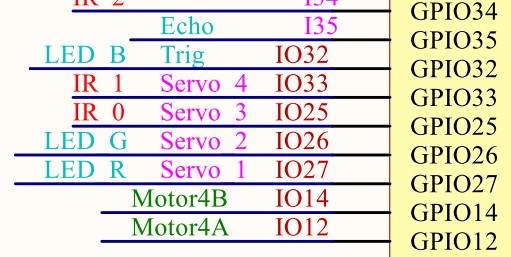
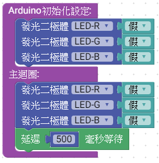
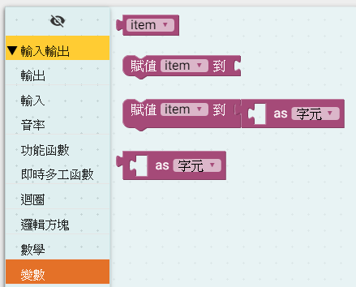
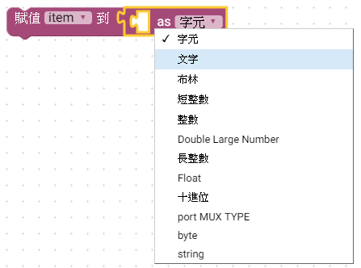
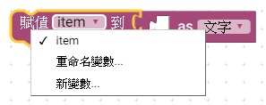
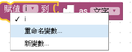
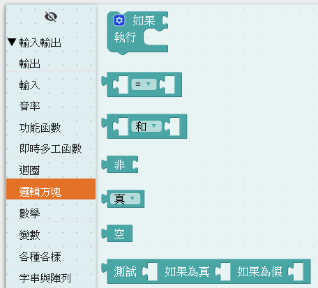
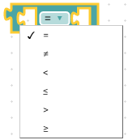
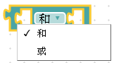
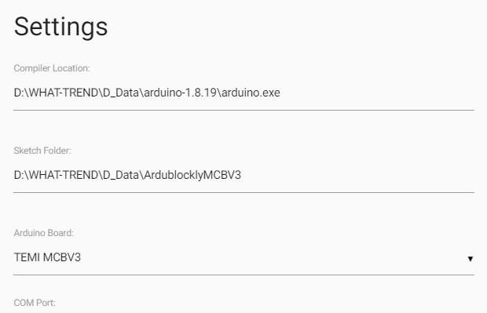

# 2_LED燈7種顏色變化說明

MCBV3 電路板，三色LED燈，積木程式利用一個byte型別的變數(color)，當主迴圈每次一個循環時，遞增color變數。

*color變數的bit0的狀態，對應輸出控制紅色LED燈(LED_R)
*color變數的bit1的狀態，對應輸出控制綠色LED燈(LED_G)
*color變數的bit2的狀態，對應輸出控制藍色LED燈(LED_B)

## 電路圖

電路中使用RGB共陰極之三色LED燈，
R、G、B LED的陽極連接330 歐姆的電阻，與ESP32 MCU模組的 IO27、IO26、IO32連接

故韌體程式令IO27、IO26、IO32其中一腳輸出高準位(1、HIGH、true)，即可使對應的LED亮。
其中:
紅色LED燈為LED_R ，接於IO27
綠色LED燈為LED_G ，接於IO26
藍色LED燈為LED_B ，接於IO32

## Ardublockly 編輯積木程式

### 拖曳三色LED積木及時間延遲積木

拖曳積木，利用Windows 熱鍵 "Ctrl + C" 複製 及 "Ctrl + V" 貼上功能，加速產生重複的積木

### 拖曳變數積木

變數積木在工具列中，
，取出變數數值；
 賦予變數數值；
，賦予變數特定型別的數值；
 ，賦予變數特定型別有字元(char),文字串(string)；布林(bool)....，為C++語言中常用的資料型態。

在變數名稱上，按下滑鼠左鍵，可將變數重新命名或產生新的變數，此練習選擇 "新變數"後，重新命名變數名稱。

 ==> 

### 拖曳邏輯方塊積木

 
為條件判斷式積木，點選齒輪

拖曳可以增加判斷選項

 
數值比較積木，可以更改比較的條件，比較輸出布林值結果(true 或 false)真(1)或假(0)
 
布林邏輯運算
 
測試方程式輸出對應結果值<== 此練習使用

## 完整的積木程式

#### 儲存積木程式

"Save" 為儲存積木程式，"Open" 為開啟積木程式檔案。
設定存檔檔名為"<a href="LED_RGB_7.xml">LED_RGB_7.xml</a>"

## 上傳積木程式至Arduino IDE
，符號變成籃底，點擊後，即啟動Arduino IDE，並將原始碼同步上傳到Arduino IDE中。

### 無法啟動

如果無法啟動Arduino IDE，請檢查EDIT-> preferences 中Compiler Location設定，沒有指定到正確的Arduino IDE程式。

*Arduino IDE需要使用TEMI協會壓縮的版本,適用於MCBV3電路板的Arduino IDE 下載網址:
https://drive.google.com/file/d/13tvwNZd0RjvDPp21khZYmijjzD2jenMy/view?usp=drive_link

## Arduino IDE 編譯及上傳

### 編譯及上傳

 Arduino 原始程式碼:

<pre><code>
int color;

void setup() {
  	pinMode(27, OUTPUT);
	pinMode(26, OUTPUT);
	pinMode(32, OUTPUT);

  digitalWrite(27,false);
  digitalWrite(26,false);
  digitalWrite(32,false);
  color = 0;

}

void loop() {
  digitalWrite(27,(color & 1 ? true : false));
  digitalWrite(26,(color & 2 ? true : false));
  digitalWrite(32,(color & 4 ? true : false));
  color += 1;
  delay(500);

}
</code></pre>
當設定確後，點選 向右箭頭，Arduino IDE進行程式碼的編譯及上傳。

當上傳完成後，在Arduino IDE下部，出現"上傳完畢"訊息，以及訊息框中出現
表示設定正確，此時MCBV3電路板 紅色、綠色、黃色、藍色、紫色、青色、白色、不亮，LED燈持續 0.5秒變化

#### 上傳程式後關閉Adruino IDE

如果設定正確運行，欲修改積木程式，進行下個練習時，請關閉Arduino IDE ，此時Arduino IDE 會記錄當前設定，以備下回啟動時引用。
