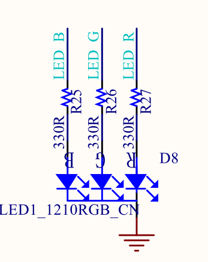

# 3_LED燈_輸出輸入練習

MCBV3 電路板，三色LED燈，積木程式利用一個byte型別的變數(color)，當主迴圈每次一個循環時，遞增color變數。

*color變數的bit0的狀態，對應輸出控制紅色LED燈(LED_R)
*color變數的bit1的狀態，對應輸出控制綠色LED燈(LED_G)
*color變數的bit2的狀態，對應輸出控制藍色LED燈(LED_B)

## 電路圖

電路中使用RGB共陰極之三色LED燈，
R、G、B LED的陽極連接330 歐姆的電阻，與ESP32 MCU模組的 IO27、IO26、IO32連接

故韌體程式令IO27、IO26、IO32其中一腳輸出高準位(1、HIGH、true)，即可使對應的LED亮。
其中:
紅色LED燈為LED_R ，接於IO27
綠色LED燈為LED_G ，接於IO26
藍色LED燈為LED_B ，接於IO32

# 紅色LED + 0.5亮0.5滅閃爍

## 紅色LED + 0.5亮0.5滅閃爍三色LED積木及時間延遲積木程式

### [LED_R_Btn_00.xml](LED_R_Btn_00.xml)積木程式

### 積木程式說明

## Arduino  程式

### Arduino 原始程式碼:

<pre><code>
int color;

void setup() {
  pinMode(27, OUTPUT);
  pinMode(26, OUTPUT);
  pinMode(32, OUTPUT);

  digitalWrite(27,false);
  digitalWrite(26,false);
  digitalWrite(32,false);
  color = 0;

}

void loop() {
  digitalWrite(27,(color & 1 ? true : false));
  digitalWrite(26,(color & 2 ? true : false));
  digitalWrite(32,(color & 4 ? true : false));
  color += 1;
  delay(500);

}

</code></pre>

### 原始程式說明
