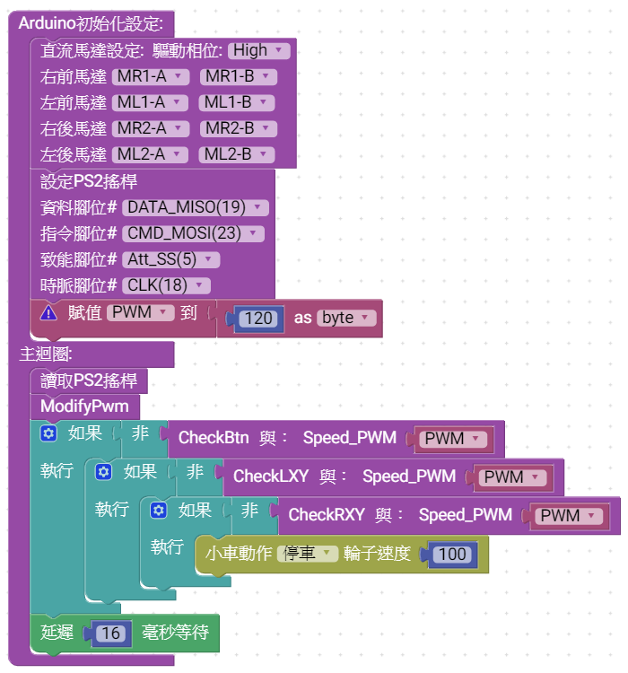

## 說明

    利用MCBV3的PS2 連接埠，與無線PC2 搖桿接收器連接，韌體驅動PS2搖桿後，定時讀取PS2搖桿接收器，讀取間隔時間大約16mS(每秒低於60次)以獲取遠端搖桿的按鍵與左右搖桿XY軸的數據。

    利用PS2無線搖桿相的按鍵左右搖桿來設計ATTEMI小車，透過控制4軸馬達正反轉或停止，搭配麥克納姆輪，達到操作小車做出18種運動模式。
   ## 基本功能如下:
   * #### 利用R1、R2、L1、L2等按鍵來設置小車運動時的輪子速度 ####
   * #### 利用向上、向下、向左、向右等按鍵來產生前輪左右滑行，後輪左右滑行等4種小車運動模式 ####
   * #### 利用三角形、X、方形、圓等按鍵來產生前進、後退、左旋、右旋等4種小車運動模式 ####
   * #### 利用左搖桿，產生8個方向方位，來產生前進、後退、左斜前進，右斜前進、左斜後退，右斜後退及左、右移等8種不改變姿態的小車運動模式 ####
   * #### 利用右搖桿，產生6個方向方位，來產生前進、後退、向左轉，向右轉、向左退，向右退等6種小車運動模式 ####

### 

* **無線PS2搖桿與MCBV3連接**

PS2無線搖桿接收器與MCBV3電路板，利用連接器串接起來，接線與插接接收器時，須注意腳位方向，錯誤的方向，會使接收器燒毀。

 

###
* **無線PS2搖桿積木**

無線PS2搖桿積木，於工具列 ==> IOT ==> 通訊 ==> PS2X搖桿控制器中，首先使用"設定PS2搖桿"，驅動MCBV3與PS2接收器連接，再使用"讀取PS2搖桿"獲取最新的搖桿狀態，最後利用檢查的積木，取出搖桿對應的按鍵或軸的數據，進行操作。
<a href="PS2_1.xml">下載積木程式檔 PS2_1.xml</a>

PS2無線搖桿接收器在Arduino初始化設定區塊，驅動MCBV3與接收器連接的腳位，使用預設即可。主迴圈安排讀取PS2積木，每次讀取後，需要延遲一段時間(大約16ms)，讓PS2搖桿接收器有時間與遠端的搖桿通訊，取得最新的狀態。

# AITEMI PS2遙控車的積木程式

## Arduino 初始化
   PS2遙控車，初始化需要驅動4軸直流馬達以及PS2搖桿接收器，並且創建一個PWM變數，提供修改AITEMI 小車的馬達轉動的速度。
   

   ### 4軸馬達驅動
   #### 工具列 => 馬達 => 直流馬達驅動
      包含馬達驅動的積木以及小車動動作的積木，請選用4軸馬達，紫色設定的積木及土黃色動作積木。

   ### PS2無線搖桿
   #### 工具列 => IOT => PS2X搖桿控制器
      包含PS2X搖桿控制器驅動、讀取PS2接收器數據及檢查PS2搖桿上的按鍵與L、R軸狀態的積木。
      
   ### 創建一個PWM變數
   #### 工具列 => 變數 => 
      拖曳初始化區塊中，在拖曳數學工具列中的一個數字積木 
 更改數值為120
在賦值 item 點擊滑鼠左鍵-> 新變數 ,預設的變數名稱為 i
在賦值 i 點擊滑鼠左鍵-> 重新命名新變數.. ，更名成PWM

### 利用R1、R2、L1、L2等按鍵來設置小車運動時的輪子速度-> 改變PWM變數數值
#### 創建一個ModifyPwm功能函數 
   #### 工具列 => 功能函數 =>  做點什麼 積木
拖曳新增一個函數，放到積木程式編輯區中，點擊 "做點什麼"，鍵入"ModifyPwm"，將函數改名稱，請注意，函數名稱只能使用英文字母組合而成，不可使用中文，當修改函數名稱後，工具列 => 功能函數看到新增的函數積木。

#### ModifyPwm功能函數
當讀取PS2搖桿後，利用如果、執行、否則如果條件判斷邏輯積木，來判斷當按下R1鍵時，設定PWM變數為255(最大值)；判斷當按下R2鍵時，設定PWM變數為200；判斷當按下L1鍵時，設定PWM變數為150；判斷當按下L2鍵時，設定PWM變數為100。

要擴充如果、執行積木，請按下如果左側齒輪即可拖曳新增修改如果、否則如果..結構。

檢查搖桿按鍵積木，提供選擇要檢查哪一個PS2搖桿的按鍵被按下，當設定的按鍵被按下時，積木會回傳1，當沒按下時，回傳0
 

### 利用向上、向下、向左、向右等按鍵來產生前輪左右滑行，後輪左右滑行等4種小車運動模式及利用三角形、X、方形、圓等按鍵來產生前進、後退、左旋、右旋等4種小車運動模式 
#### 創建一個CheckBtn功能函數 
   #### 工具列 => 功能函數 =>  做點什麼 積木
拖曳新增一個函數，放到積木程式編輯區中，點擊 "做點什麼"，鍵入"CheckBtn"，將函數改名稱，請注意，函數名稱只能使用英文字母組合而成，不可使用中文，當修改函數名稱後，工具列 => 功能函數看到新增的函數積木樣式與前一個函數不同。這個積木具備輸入引數以及回傳值。
輸入引數用來設定馬達的PWM數據達到控制小車運動時輪子的轉速。
回傳值用來回傳此函數是否產生小車運動模式，當有進行小車操作時回傳1，反之回傳0。

   創建好的 "CheckBtn" 功能函數，請按下左側齒輪 新增功能函數的引數，即呼叫函數時，傳給函數的變數，請新增一個型別為byte，名稱為 "SpeedPWM"的變數，此時功能函數名稱旁邊多了"與:Speed_PWM"，這個變數

#### CheckBtn功能函數

要擴充如果、執行積木，請按下如果左側齒輪即可拖曳新增修改如果、否則如果..結構。
檢查搖桿按鍵積木，提供選擇要檢查哪一個PS2搖桿的按鍵被按下，當設定的按鍵被按下時，積木會回傳1，當沒按下時，回傳0；也可以在積木程式編輯區抓取 "ModifyPwm功能函數"內的如果...，按下鍵盤 CTRL+C 組合鍵，將ModifyPwm功能函數存入記憶體中，再按下鍵盤 CTRL+V 組合鍵，將記憶體中的如果...積木組合貼到CheckBtn功能函數內在進行修改。

小車動作積木，傳入 輪子速度，此時工具列中 ,  可以找到CheckBtn 傳入的Speed_PWM變數名稱。

#### 利用左搖桿，產生8個方向方位，來產生前進、後退、左斜前進，右斜前進、左斜後退，右斜後退及左、右移等8種不改變姿態的小車運動模式

#### 創建一個CheckLXY功能函數，步驟與CheckBtn功能函數相同 
   #### 工具列 => 功能函數 =>  做點什麼 積木
   創建好的 "CheckLXY" 功能函數，請按下左側齒輪 新增功能函數的引數，即呼叫函數時，傳給函數的變數，請新增一個型別為byte，名稱為 "SpeedPWM"的變數，此時功能函數名稱旁邊多了"與:Speed_PWM"這個變數，並且在函數積木結尾多一個返回值，返回值可以是一個數值或變數，在此需要定義返回值的型別，預設為long，請改成byte。

#### CheckLXY功能函數

判斷左搖桿Y軸，上中下，故使用"如果、否則如果、否則"邏輯判斷積木，並使用大於小於等於...機積木來判斷Y軸的上中下區間，上為Y軸小於50的範圍(7,8,9)，中為Y軸小於200的範圍(4,5,6)，扣除小於50，下為Y軸大於200的範圍，會落入"否則區間"(1,2,3)，在判斷Y軸的三個區間中，分別插入判斷Y軸的左(小於50)、中(小於200)、右三個區間中(否則)，此時就可分別產生一共9個區間，對應鍵盤數字鍵區1~9等9個搖桿方位。
在上部插入小車的動作

7、8、9上部，控制小車前進的方式；
* **7為左斜前進**
* **8為前進**
* **9為右斜前進**

4、5、6中部，控制小車橫移；
* **4為左橫移**
* **5 不動作**
* **6為右橫移**

1、2、3下部，控制小車後退的方式；
* **1為左斜後退**
* **2為後退**
* **3為右斜後退**
  

#### 利用右搖桿，產生6個方向方位，來產生前進、後退、向左轉，向右轉、向左退，向右退等6種小車運動模式 ####
 
#### 創建一個CheckRXY功能函數，步驟與CheckBtn功能函數相同 
   #### 工具列 => 功能函數 =>  做點什麼 積木
   重複創建的 "CheckLXY" 功能函數的步驟，創建CheckRXY功能函數，或按下鍵盤 CTRL+C 組合鍵，將CheckLXY功能函數存入記憶體中，再按下鍵盤 CTRL+V 組合鍵，將記憶體中的積木組合貼到積木程式編輯區內在進行修改。

   抓取CheckLXY功能函數時，函數積木外框會呈現黃色顯示出抓取的範圍，再按下鍵盤 CTRL+C 組合鍵，進行複製
   
當積木程式被複製到記憶體後，再按下鍵盤 CTRL+C 組合鍵，進行貼上，此時貼上的積木程式，會貼在原來的積木程式上方，再利用滑鼠抓取到其他位置。

當複製貼上CheckLXY功能函數，新複製的功能函數名稱，會在原來的名稱後面增加一個數字CheckLXY2是新的功能函數名稱。
更改CheckLXY2功能函數名稱改為"CheckRXY"。

#### CheckRXY功能函數

由於右搖桿，指定義6個功能，修改CheckRXY，請注意條件判斷式須改判斷Ry及Rx

7、8、9上部，控制小車前進的方式；
* **7為左轉彎**
* **8為前進**
* **9為右轉彎**

4、5、6中部，控制小車橫移；
* **4 不動作**
* **5 不動作**
* **6 不動作**

1、2、3下部，控制小車後退的方式；
* **1為左彎後退**
* **2為後退**
* **3為右彎後退**
  
### 當創建功能函數後，修改Arduino 主迴圈(loop)
 
#### 當創建ModifyPwm、CheckBtn、CheckLXY、CheckRXY等功能函數後，開始進行主程式
#### 工具列 => 功能函數 => 增加了以新增的函數積木
   
利用這些新增的函數積木，撰寫主程式迴圈的程式

### Arduino 主迴圈(loop) 
* **讀取PS2搖桿狀態**
* **根據PS2搖桿L1、L2、R1、R2按鍵，改變AITEMI小車輪子的速度**
* **PS2搖桿按鍵，控制AITEMI小車**
* **如果AITEMI小車沒有被控制，PS2左搖桿控制AITEMI小車**
* **如果AITEMI小車沒有被控制，PS2右搖桿控制AITEMI小車**
* **如果AITEMI小車沒有被控制，令AITEMI小車停車**
* **延遲16毫秒，給PS2搖桿接收器與PS2搖桿工作**

主迴圈在如果、執行的判斷式中呼叫CheckBtn、CheckLXY、CheckRXY等功能函數，當功能函數送出小車操作指令，功能函數回傳1，當沒有對小車進行操作時，回傳0，則利用這個回傳值，來判斷是否需要再呼叫其他控制函數，但如果、執行積木條件判為真時，才會執行描述的程式，但是CheckBtn、CheckLXY、CheckRXY等功能函數回傳0才是需要執行其他的控制程式，故在呼叫這接函數後，回傳值增加一個"非"(not)的邏輯積木，"非"(not)的邏輯積木將傳入的值，進行邏輯的反相後再輸出，當輸入值為0時，"非"(not)邏輯積木輸出1(true、真)，當輸入值為大於0時，例如1，2，3...，"非"(not)邏輯積木輸出0(false、假)
因此當呼叫功能函數，如果該函數對AITEMI小車控制，功能函數回傳1，經過"非"(not)邏輯積木變成0，如果、執行積木，條件判斷結果不執行。

<a href="AITEMI_PS2.xml">下載積木程式檔 AITEMI_PS2.xml</a>

PS2搖桿控制AITEMI小車 Arduino 原始程式碼:

<pre><code>
#include  <PS2X_lib_temi.h>  // TEMI協會修改版本，PS2搖桿程式庫

PS2X ps2x; // create PS2 Controller Class //建立ps2x物件
byte  ps2x_vibrate = 0;  //ps2x搖桿振動變數，預設0不振動

void setup() {
  // 設定ps2x物件，輸入引數為接收器與MCBV3連接的腳位	
  ps2x.config_gamepad(18, 23, 5, 19, 0, 0);  //Setup PS2 Remote controller
    
	//初始化設定 LED燈，不亮
  	pinMode(27, OUTPUT);
	pinMode(26, OUTPUT);
	pinMode(32, OUTPUT);

  	pinMode(27, OUTPUT);
   
  digitalWrite(27,false);
  digitalWrite(26,false);
  digitalWrite(32,false);

}

void loop() {
      ps2x.read_gamepad(0, ps2x_vibrate);  //DualShock Controller//讀取PS2搖桿接收器的數據
  if (ps2x.Button(PSB_PAD_UP)) {  // 判斷PS2搖桿數據，如果UP按鍵為1
    digitalWrite(27,true );       //    點亮紅色LED燈
  } else {                        // 否則
    digitalWrite(27,false );      //    關閉紅色LED燈
  }
  delay(16);                      //延遲16毫秒，給PS2接收器與搖桿通訊

}
</code></pre>
   
